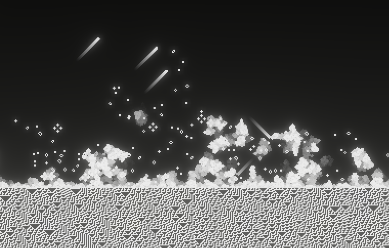

# colliding_automatas

What if a 1d cellular automata was used as the input to a 2d cellular automata?

[Click here for the live web version!](https://jakkos.net/colliding_automatas) (requires  a browser WebGPU support e.g. Chrome [you can check here](https://caniuse.com/webgpu))

I took this idea from [Elliot Waite's video]. It's really cool, but was sad there wasn't a version that runs in real time (or on the web!).

## Building

### Native
- [Install Rust](https://www.rust-lang.org/learn/get-started)
- Clone the repo
- Run `cargo run --release`

### Web
- [Install Rust](https://www.rust-lang.org/learn/get-started)
- Install trunk: `cargo install trunk --locked`
- Clone the repo
- Run `trunk build --release`
- The `dist/` folder will contain the web files to host

